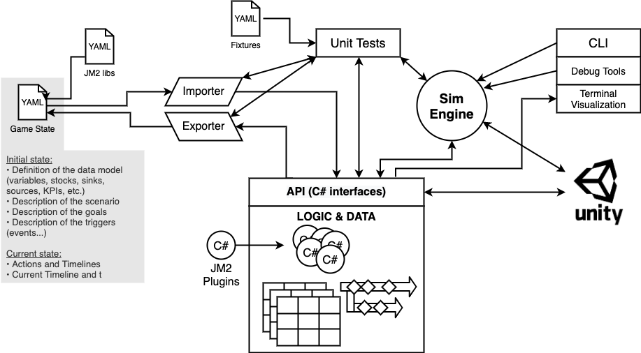

Notes
=====

Architecture
------------

TODO
----

- Clean-up of the API (accessors, World factory, etc)
- Document the API interfaces
- More defensive code, better error handling, etc. Don't trust the YAML files
- Still too many casts in World.cs
- Importer: load the `scenario` block
- Debug resources with `null` units
- Units should have a conversion table when possible. Define standard units with implicit conversions
- Bug: interactive mode will fail if `time.end` is not set in file

Command line samples
--------------------

    -vv -d 0 -g -i /Users/yann/dev/worldsim-engine/tests/fixtures/map02.yaml

    -vv /Users/yann/dev/worldsim-engine/tests/fixtures/source01.yaml
    -v -csv /Users/yann/dev/worldsim-engine/tests/fixtures/source01.yaml
    -vv -csv -t 1815-01-01 /Users/yann/dev/worldsim-engine/tests/fixtures/map02.yaml
